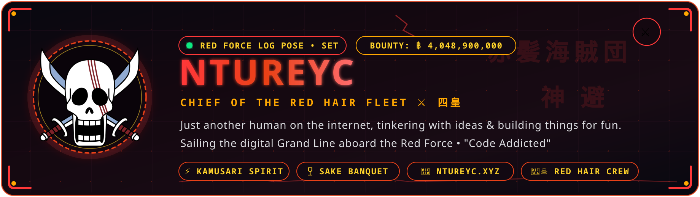
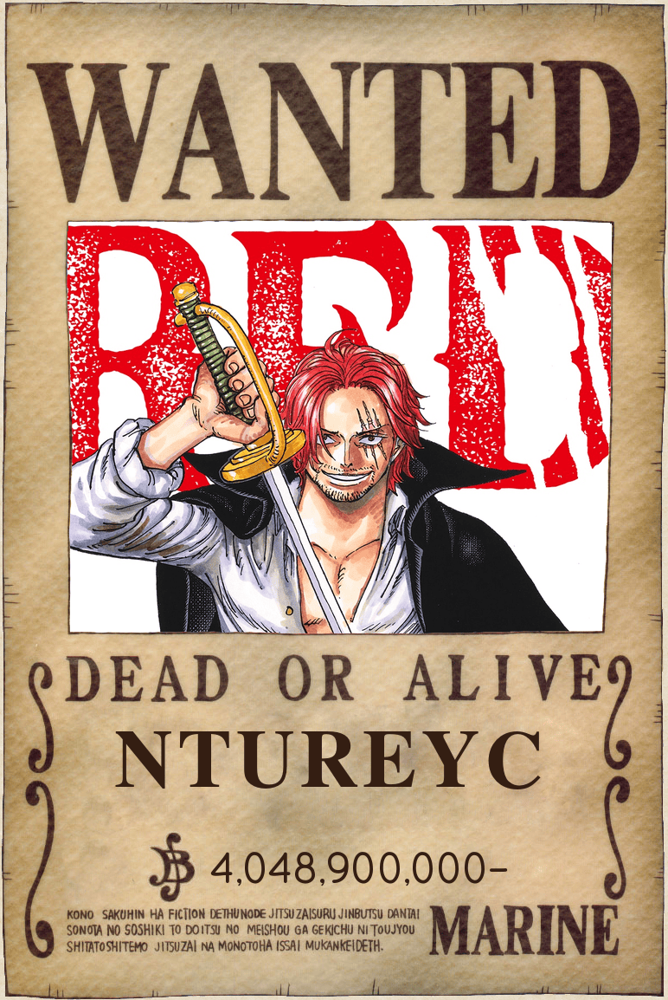
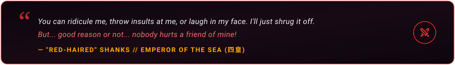

  <!-- RED HAIR PIRATES HEADER BANNER -->
  

    

  <!-- DYNAMIC TYPING SVG (RED HAIR PIRATES SHANKS THEME) -->
  

   

  <!-- STATUS BADGES -->
  

    
    
    
    
  

##  Captain's Log // Red Force Logbook

<table>
  <tr>
    <td width="36%" align="center" valign="top">
      
        
      
    </td>
    <td width="64%" valign="top">
      <h3> Welcome Aboard the Red Force!</h3>
      

        Just another human on the internet, tinkering with ideas and building things for fun.
      

      <ul>
        <li> <b>The Code:</b> Easygoing and always happy to connect, share ideas, or collaborate on a great project. We laugh off the small things and focus on what truly matters.</li>
        <li> <b>The Voyage:</b> Exploring the digital Grand Line with an insatiable curiosity and a love for clean creation.</li>
        <li> <b>Fun Fact:</b> I probably drink more water than my laptop consumes power.</li>
        <li> <b>Captain's Creed:</b> <i>"You can ridicule me, you can insult me... I'll just shrug it off. But good reason or not, nobody hurts a friend of mine!"</i> — Red-Haired Shanks</li>
      </ul>
      

        
      

    </td>
  </tr>
</table>

##  Red Hair Fleet // Featured Treasures

  <table>
    <tr>
      <td width="50%" valign="top">
        <h3 align="center"> <a href="https://github.com/Ntureyc/SuperV">SuperV</a></h3>
        

          <b>Windows 11-style clipboard history flyout (Super+V) for GNOME Shell</b> 
          Featuring auto-close, instant search, pin/unpin, and auto-paste.
        

        

          
          
          
        

      </td>
      <td width="50%" valign="top">
        <h3 align="center"> <a href="https://github.com/Ntureyc/BitBeat">BitBeat</a></h3>
        

          <b>Minimalist Windows &amp; Linux music player</b> 
          Built for local files and smooth, seamless playback.
        

        

          
          
          
        

      </td>
    </tr>
  </table>

##  Red Force Navigation // Battle Records

  <!-- MOST USED LANGUAGES (RED HAIR PIRATES PALETTE) -->
  

    
  

  <!-- CURRENT STREAK STATS (RED HAIR PIRATES PALETTE) -->
  

    
  

   

  <!-- RED FORCE CONTRIBUTION VOYAGE -->
  <h4> Red Force's Contribution Voyage</h4>
  <picture>
    <source media="(prefers-color-scheme: dark)" srcset="https://raw.githubusercontent.com/Ntureyc/Ntureyc/output/github-contribution-grid-snake-dark.svg" />
    <source media="(prefers-color-scheme: light)" srcset="https://raw.githubusercontent.com/Ntureyc/Ntureyc/output/github-contribution-grid-snake.svg" />
    
  </picture>

##  Den Den Mushi // Transponder Snail (Connect)

  

    Always happy to connect, share, and learn from others:
  

  

    
    
    
  

 

<!-- SIGNATURE SHANKS QUOTE BANNER -->

  
    
   Sailing the digital Grand Line with the Red Hair Pirates • <b><a href="https://github.com/Ntureyc">Ntureyc</a></b> • 赤髪海賊団 // 四皇

